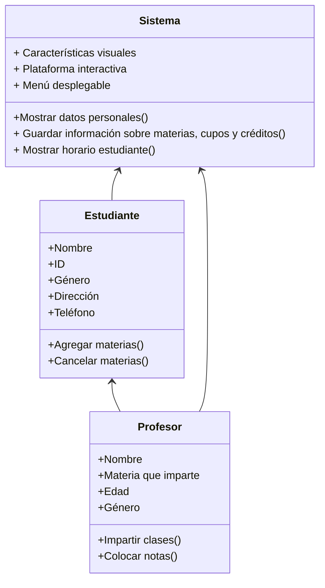
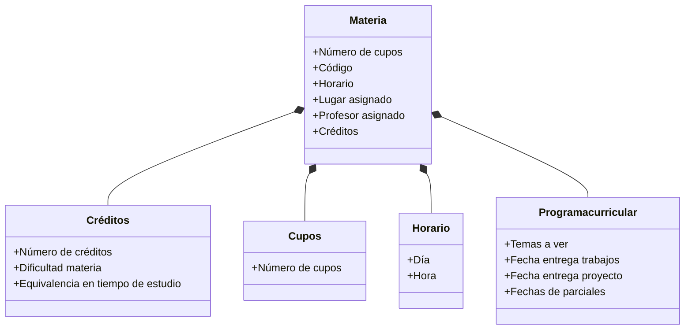
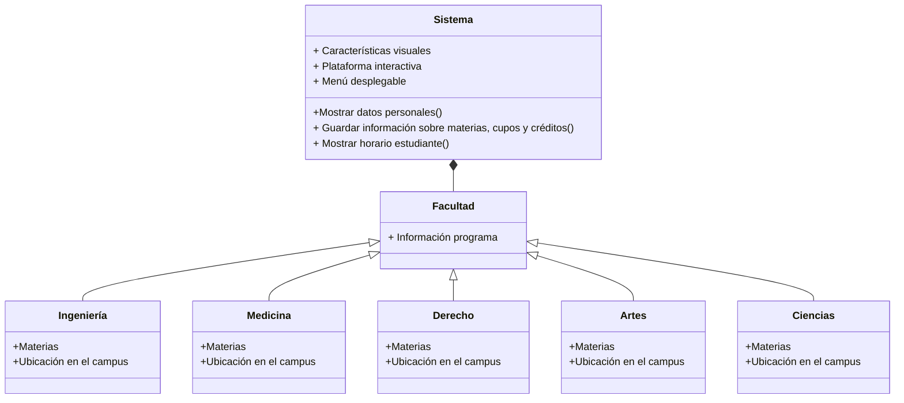

# Reto 2 - Diagrama de Clases

Para demostrar las diferentes diferencias entre relaciones, herencias y composiciones entre clases decidí hacerlo a través de lo que sería un sistema de créditos y cupos de materias.

Por ejemplo para demostrar lo que serían las relaciones, lo hice a través del siguiente diagrama:

Luego para demostrar lo que es la composiciónn, lo hice a partir de la clase materia, la cual está compuesta de un número de créditos, un número de cupos, un horario, un programa curricular y algunas características más:

Por último para demostrar la herencia, decidí hacerlo a partir de las diferentes facultades, las cuales a pesar de tener diferentes mallas curriculares se rigen por el mismo sistema. Esto quiere decir que cada facultad se rige por los mismos métodos para acceder al ingreso de materias con la diferencia de que cada facultad tiene características en su programa que los diferencia del resto.

